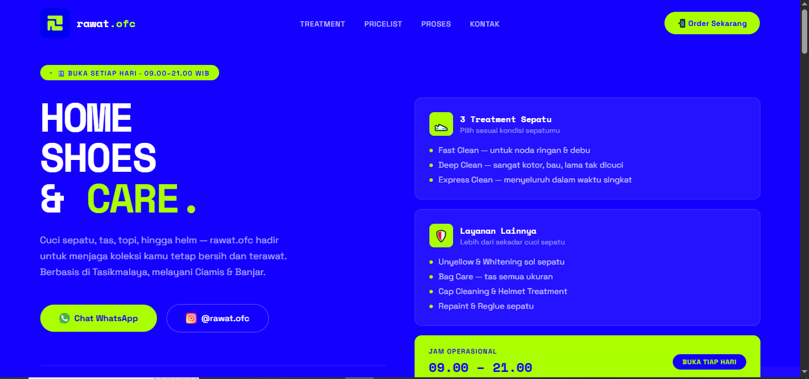

# 👟 Rawat.OFC — Website Landing Page

**Rawat.OFC** adalah website landing page yang saya buat untuk membantu teman saya yang memiliki usaha jasa **cuci dan perawatan sepatu**.

Website ini berfungsi sebagai media informasi dan promosi digital yang menampilkan layanan, harga, proses pengerjaan, area pelayanan, serta kontak yang dapat digunakan pelanggan untuk melakukan pemesanan.

🌐 **Website:** https://rawatofc.my.id/

---

## 📌 Latar Belakang

Project ini dibuat berdasarkan kebutuhan nyata dari sebuah usaha jasa perawatan sepatu.

Sebelum adanya website, informasi mengenai layanan, harga, cara pemesanan, dan area pelayanan dapat disampaikan secara terpisah melalui media sosial atau komunikasi langsung.

Oleh karena itu, saya membuat sebuah landing page yang berfungsi sebagai **pusat informasi digital** bagi pelanggan.

Dengan adanya website ini, calon pelanggan dapat melihat informasi utama mengenai Rawat.OFC dalam satu halaman sebelum menghubungi pemilik usaha.

---

## 🎯 Tujuan Project

Project ini bertujuan untuk:

- Membantu usaha memiliki media promosi digital.
- Menyediakan informasi layanan dalam satu halaman.
- Menampilkan daftar harga secara lebih terstruktur.
- Memudahkan pelanggan mengetahui proses pemesanan.
- Memudahkan pelanggan menghubungi pemilik melalui WhatsApp dan Instagram.
- Membuat identitas digital yang lebih profesional untuk usaha.

---

## 🖥️ Hasil Project

Hasil akhir dari project ini berupa **landing page website**, bukan sistem transaksi atau aplikasi kasir.

Website dirancang dengan fokus pada:

```text
Informasi Usaha
      ↓
Layanan
      ↓
Harga
      ↓
Keunggulan
      ↓
Proses
      ↓
Area Pelayanan
      ↓
Kontak / Order
```

Landing page dapat diakses secara online melalui:

👉 https://rawatofc.my.id/

---

## 📸 Screenshot

Berikut adalah tampilan landing page Rawat.OFC:



---

## ✨ Bagian-Bagian Website

### 🏠 1. Hero / Beranda

Bagian utama website memperkenalkan identitas Rawat.OFC melalui headline:

> **HOME SHOES & CARE.**

Bagian ini juga menjelaskan bahwa Rawat.OFC menyediakan layanan perawatan sepatu, tas, topi, dan helm.

Terdapat tombol:

- **Chat WhatsApp**
- **Instagram**
- **Order Sekarang**

Website juga menampilkan informasi bahwa Rawat.OFC berbasis di **Tasikmalaya** dan melayani area **Ciamis dan Banjar**.

---

### 👟 2. Treatment Sepatu

Website menyediakan tiga jenis treatment utama:

| Treatment | Keterangan |
|---|---|
| **Fast Clean** | Untuk noda ringan dan debu |
| **Deep Clean** | Untuk sepatu yang sangat kotor, bau, atau lama tidak dicuci |
| **Express Clean** | Pembersihan menyeluruh dalam waktu singkat |

Bagian ini membantu pelanggan menentukan jenis treatment berdasarkan kondisi sepatu.

---

### 🧰 3. Layanan Lainnya

Selain pencucian sepatu, website juga menampilkan layanan tambahan:

- Unyellow & Whitening
- Bag Care
- Cap Cleaning
- Helmet Treatment
- Repaint
- Reglue

Dengan demikian, website tidak hanya mempromosikan jasa cuci sepatu tetapi juga seluruh layanan perawatan yang tersedia.

---

### 💰 4. Pricelist

Website menyediakan daftar harga sehingga pelanggan dapat mengetahui estimasi biaya sebelum melakukan pemesanan.

Contoh layanan yang ditampilkan:

**Shoe Cleaning**
- Fast Cleaning — Rp30.000
- Deep Clean Regular Mild — Rp40.000
- Deep Clean Regular Hard — Rp50.000
- Deep Clean Premium Mild — Rp100.000
- Deep Clean Premium Hard — Rp120.000

**Unyellow & Whitening**
- Mild — Rp50.000
- Hard — Rp70.000
- Premium — Rp100.000

**Bag Care**
- Very Small — Rp30.000
- Small — Rp50.000
- Medium — Rp100.000
- Large — Rp120.000

Website juga menampilkan harga untuk Cap Cleaning, Helmet Treatment, Repaint, dan Reglue.

---

### ⭐ 5. Keunggulan

Bagian ini digunakan untuk membangun kepercayaan calon pelanggan.

Beberapa informasi yang ditampilkan:

- Dokumentasi foto sebelum dan sesudah pengerjaan.
- Penggunaan produk perawatan.
- Area pelayanan hingga 3 kota.
- Operasional setiap hari.

---

### 🔄 6. Proses Pengerjaan

Website menjelaskan proses pemesanan dalam empat langkah:

```text
01. Hubungi Kami
        ↓
02. Antar Sepatu
        ↓
03. Proses Pengerjaan
        ↓
04. Ambil Sepatu Bersih
```

Hal ini membuat pelanggan mengetahui alur layanan sebelum melakukan pemesanan.

---

### 📍 7. Area Pelayanan

Rawat.OFC berbasis di:

- Tasikmalaya
- Ciamis
- Banjar

Informasi area ini membantu calon pelanggan mengetahui apakah layanan tersedia di wilayah mereka.

---

### 📞 8. Kontak

Bagian kontak menyediakan beberapa informasi penting:

- WhatsApp
- Instagram
- Jam operasional
- Informasi hari operasional

Pelanggan dapat langsung menghubungi usaha untuk konsultasi atau melakukan pemesanan.

---

## 🎨 Konsep Desain

Website menggunakan konsep visual yang dibuat agar sesuai dengan karakter brand Rawat.OFC.

Beberapa pendekatan desain yang digunakan:

- Tampilan modern dan minimalis.
- Warna dominan biru dengan aksen hijau terang.
- Tipografi yang tegas pada bagian headline.
- Tombol Call-to-Action yang mudah ditemukan.
- Layout berbasis section agar informasi mudah dipindai.
- Responsive layout untuk berbagai ukuran layar.

Tujuan desainnya adalah membuat website terlihat **modern, sederhana, dan mudah digunakan sebagai media promosi usaha**.

---

## 🛠️ Teknologi

Project ini dibuat sebagai website statis/landing page menggunakan teknologi web dasar:

- **HTML5** — struktur halaman.
- **CSS3** — styling dan layout.
- **GitHub** — version control dan repository.
- **GitHub Pages** — hosting website.
- **Custom Domain** — `rawatofc.my.id`.

Repository saat ini berisi file utama seperti `index.html`, `logo.jpg`, dan `CNAME`.

---

## 🚀 Deployment

Website dipublikasikan menggunakan GitHub Pages dan menggunakan custom domain:

```text
https://rawatofc.my.id/
```

Alur deployment:

```text
Source Code
    ↓
GitHub Repository
    ↓
GitHub Pages
    ↓
Custom Domain
    ↓
rawatofc.my.id
```

---

## 📂 Struktur Project

Struktur dasar repository:

```text
rawatofc/
├── index.html
├── logo.jpg
├── CNAME
└── README.md
```

---

## 💼 Nilai Project

Project ini merupakan contoh penerapan kemampuan pengembangan web untuk menyelesaikan kebutuhan nyata.

Berbeda dari project yang hanya dibuat sebagai latihan, website ini dibuat berdasarkan kebutuhan usaha milik teman sehingga proses pengembangannya mempertimbangkan:

- Kebutuhan informasi pelanggan.
- Identitas visual usaha.
- Kemudahan navigasi.
- Informasi harga.
- Call-to-Action.
- Kontak pemesanan.
- Area pelayanan.
- Kebutuhan promosi digital.

---

## 📚 Pembelajaran

Melalui project ini saya mendapatkan pengalaman dalam:

- Membuat landing page dari kebutuhan pengguna.
- Menyusun informasi bisnis ke dalam struktur website.
- Membuat desain antarmuka yang sesuai dengan identitas usaha.
- Mengimplementasikan responsive web design.
- Menghubungkan website dengan media sosial dan WhatsApp.
- Melakukan deployment website menggunakan GitHub Pages.
- Menggunakan custom domain.
- Mengelola source code menggunakan Git dan GitHub.

---

## 👨‍💻 Author

**Redi Grandis Vinata**

Email: redigrandisvinata21@gmail.com

---

## 🔗 Links

🌐 **Website:** https://rawatofc.my.id/

📷 **Instagram:** https://www.instagram.com/rawat.ofc

💻 **Repository:** https://github.com/ridezoldyck/rawatofc

---
